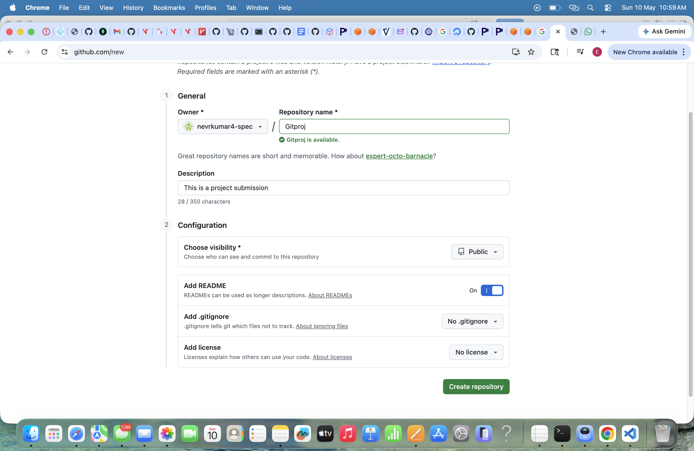
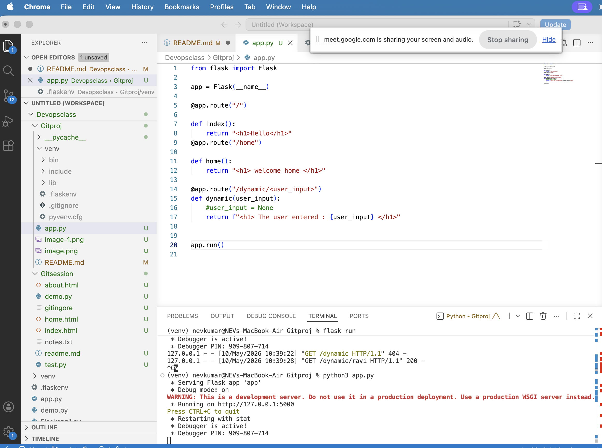
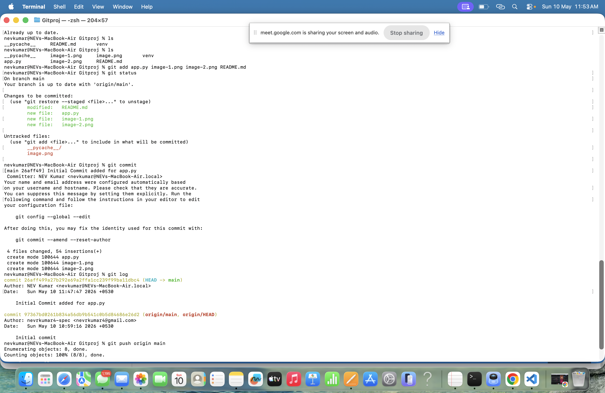

# Gitproj
This is a project submission
1. Create a Repository in the Github.com with name Gitproj

2. Type the command on the local console  (Git bash) 
     nevkumar@NEVs-MacBook-Air Gitproj % git init
3. Type command to check the status 
    nevkumar@NEVs-MacBook-Air Gitproj % git status
4. Add the remote origin into local git 
    nevkumar@NEVs-MacBook-Air Gitproj % git branch
    * master
nevkumar@NEVs-MacBook-Air Gitproj % git fetch 
remote: Enumerating objects: 3, done.
remote: Counting objects: 100% (3/3), done.
remote: Total 3 (delta 0), reused 0 (delta 0), pack-reused 0 (from 0)
Unpacking objects: 100% (3/3), 878 bytes | 175.00 KiB/s, done.
From https://github.com/nevrkumar4-spec/Gitproj
 * [new branch]      main       -> origin/main
nevkumar@NEVs-MacBook-Air Gitproj % git checkout main
branch 'main' set up to track 'origin/main'.
Switched to a new branch 'main'
nevkumar@NEVs-MacBook-Air Gitproj % git pull 
Already up to date.
nevkumar@NEVs-MacBook-Air Gitproj % ls
__pycache__	README.md	venv

5. Goto VSCode
   create a app.py under the dirctory workspace Gitproj
   steps to run the flask commands
    set envn  using the command
    >> python3 -m venv venv 
    >> source venv/bin/activate    
    Run the app.py with following command in terminal
    python3 app.py

Question 2 :